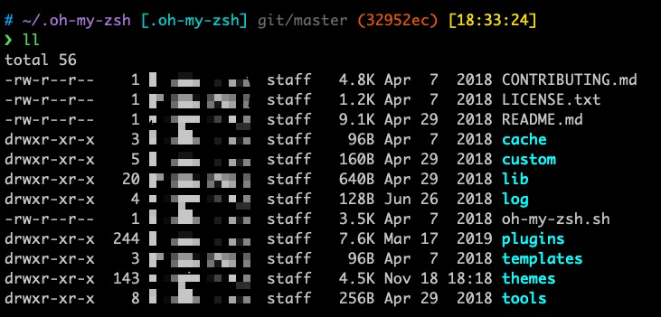
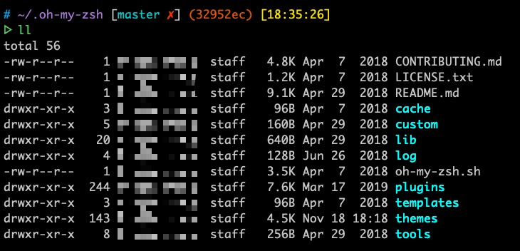

# Jacobin zsh theme
Jacobin theme is based on `refined`   theme and `ys` theme. 

## Screenshots

**Jacobin1 theme：**



**Jacobin2 theme：**



## Installation

### Use install.sh

```shell
$ sh -c "$(curl -fsSL https://raw.githubusercontent.com/Jsharkc/jacobin-zsh-theme/master/install.sh) " 
$ source ~/.zshrc
```

### Manual install

#### Clone the repository：
```
$ git clone https://github.com/Jsharkc/jacobin-zsh-theme.git
```


#### Theme 
1. Copy `jacobin1.zsh-theme`  file and `jacobin2.zsh-theme`into the `~/.oh-my-zsh/custom/themes/` directory.
2. Change the theme variable name to `ZSH_THEME="jacobin1"` or `ZSH_THEME="jacobin2"` in `~/.zshrc`
3. Reload ZSH with `source ~/.zshrc`

#### Color
You can choose your favorite iterm color scheme in [iTerm Color Schemes Site](http://www.iterm2colorschemes.com) or use Jacobin.itermcolors.

1. `iTerm2 > Preferences > Profiles > Colors Tab`
2. Click **Color Presets** (drop-down in the lower right corner)
3. Click **Import**
4. Select the color scheme file
5. Set as default